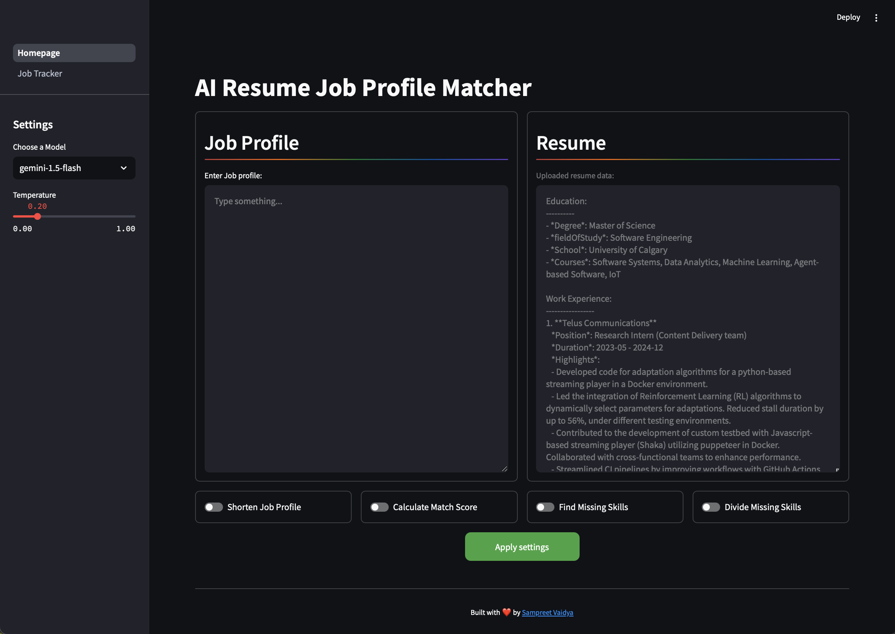

# AI resume -job profile matcher

## Overview

This project harnesses the power of Large Language Model (LLM) APIs for job profile analysis and matching. This tool can streamline the recruitment process and empower job seekers with valuable insights about the skills required.

## Key Features

- **Job Description Summarization**: Condenses lengthy job postings into concise, easy-to-digest summaries.
- **Match Score Generation**: Calculates compatibility scores between candidate profiles and job requirements.
- **Skill Gap Analysis**: Identifies missing skills in candidate profiles compared to job postings.

### Home page:



## How to use it

Clone AI-resume-profile-matcher

```bash
  git clone https://github.com/sampreetucalgary07/AI-resume-profile-matcher.git

```

Activate python environment (optional!)

```bash
# Add your environment activation command here, e.g.:
# source venv/bin/activate

```

Install requirementments

```bash
pip install -r requirements.txt

```

Update path : dEdit the file `data/resume_info.json` with your profile information.

Create a file named `api_keys.json` and add your [Google Studio key](https://aistudio.google.com/app/apikey) in the following format:

```bash
{
  "google_api_studio": [YOUR_GEMINI_API_KEY]
}

```

RUN LOCALLY:

```bash
streamlit run Homepage.py
```

You can also deploy the app using streamlit cloud.

## Extras

Make use of the job tracker feature to keep track of the jobs you've applied to. Track changes and save it periodically.

### Community Input

We encourage feature suggestions:

- Open GitHub issues
- Submit pull requests
- Participate in discussions

### Development Status

- [x] Basic job profile matching
- [x] AI-powered skill gap analysis

### Planned Enhancements

- [ ] Add more LLM models. Currently supports Gemini family of models.
- [ ] Generate resume and cover letter.

### Contact

For any questions or feedback, please open an issue in the GitHub repository or contact the maintainer at [sam.vaidya.analyst@gmail.com].
